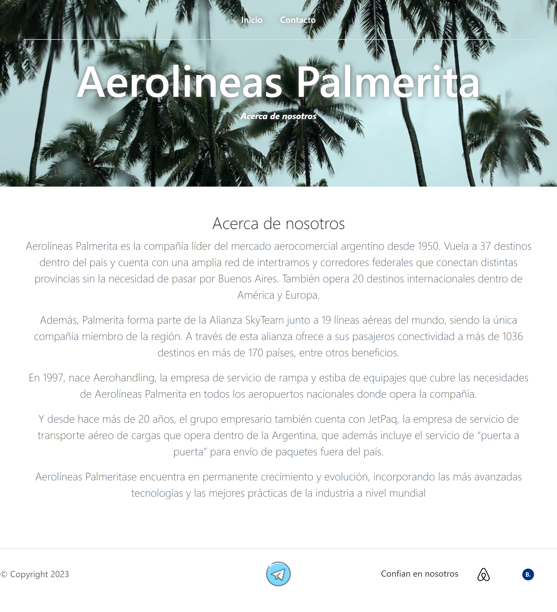
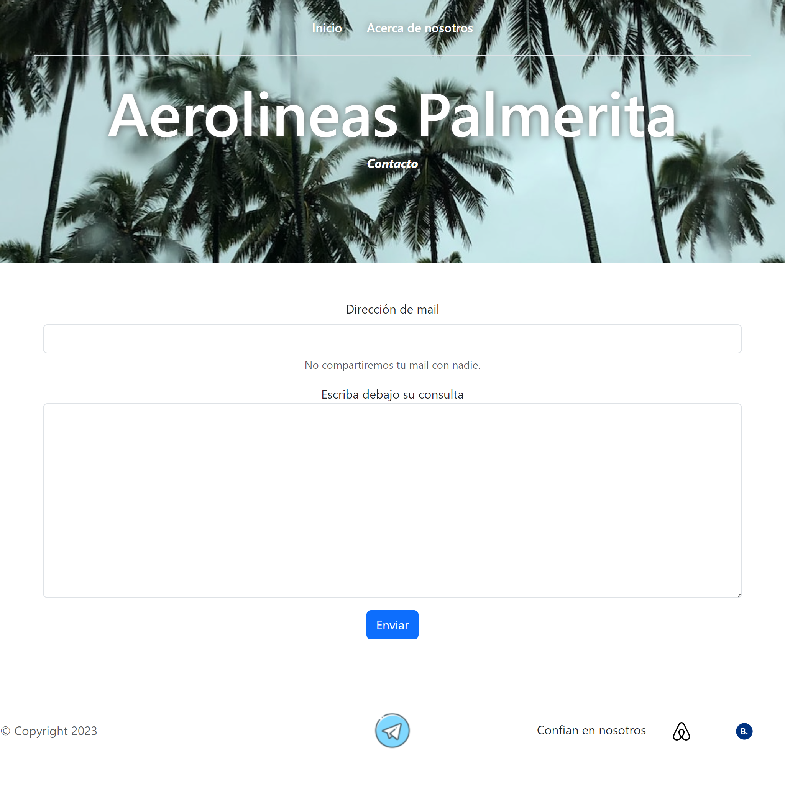

# Actividad para la facultad

## Primer vistazo a Bootstrap

Actividad libre realizada para la facultad con motivo de primer acercamiento a Bootstrap. 

Únicos requisitos que la web debía cumplir:
+ El proyecto debe tener 3 páginas (inicio, acerca de y contacto).
+ Debe utilizar Bootstrap para diseñar y desarrollar el sitio web.
+ El sitio debe ser responsive.

## Tecnologías utilizadas

+ HTML5
+ CSS3
+ Bootstrap 5

### Así es cómo se ve el sitio

